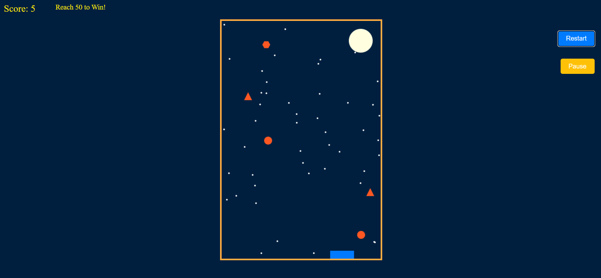

# 🎮 Catch the Falling Objects Game 🌌

## Overview
"**Catch the Falling Objects**" is a fun, browser-based game built with Flask and JavaScript. The objective is simple: catch falling objects using a basket! Enjoy a night mode filled with stars and a moon, and aim to reach a score of 50 to win! 🌟



## Features
- ✨ **Catch Falling Objects**: Colorful shapes like triangles, circles, and hexagons.
- 📱 **Responsive Design**: Optimized for desktop browsers.
- 🏆 **Scoring System**: Compete to reach a winning score of **50**.
- 🎉 **Game Over & Win Screens**: Exciting messages to celebrate your success!
- ⏸️ **Pause & Restart**: Flexibility to pause or restart your game anytime.

## Technologies Used
- **Flask**: A lightweight WSGI web application framework in Python.
- **JavaScript**: For dynamic game logic and interactivity.
- **HTML/CSS**: Structure and styling that bring the game to life.

## Installation

### Without Docker
1. **Clone the repository:**
   ```bash
   git clone https://github.com/prasanth624/Catch-the-Falling-Objects-Game.git
   cd Catch-the-Falling-Objects-Game
   ```

2. **Install Flask:**
   Ensure you have Python installed, then install Flask using pip:
   ```bash
   pip install Flask
   ```

3. **Run the Application:**
   Start the Flask server:
   ```bash
   python app.py
   ```

   The application will be accessible at `http://<your-server-ip>:5000`.

### With Docker
1. **Clone the repository:**
   ```bash
   git clone https://github.com/prasanth624/Catch-the-Falling-Objects-Game.git
   cd Catch-the-Falling-Objects-Game
   ```

2. **Build the Docker image:**
   ```bash
   docker build -t catch-the-falling-objects .
   ```

3. **Run the Docker container:**
   ```bash
   docker run -itd -p 5000:5000 catch-the-falling-objects
   ```

   The application will be accessible at `http://<your-server-ip>:5000`.

## Usage
- 🖱️ **Move your mouse** to position the basket.
- 🌠 **Catch the falling objects** to increase your score.
- ❌ **Miss three objects**, and it's game over.
- 🎯 **Reach a score of 50** to claim victory!

## Controls
- **Mouse Move**: Move the basket left and right.
- 🔄 **Restart Button**: Click to restart the game anytime.
- ⏸️ **Pause Button**: Click to pause or resume the game.

## Contributing
💡 Feel free to fork the repository and submit pull requests for any improvements or features you'd like to add!

## License
📜 This project is licensed under the **MIT License**. See the LICENSE file for more details.
